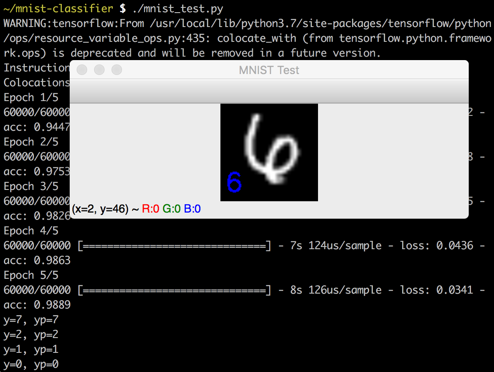
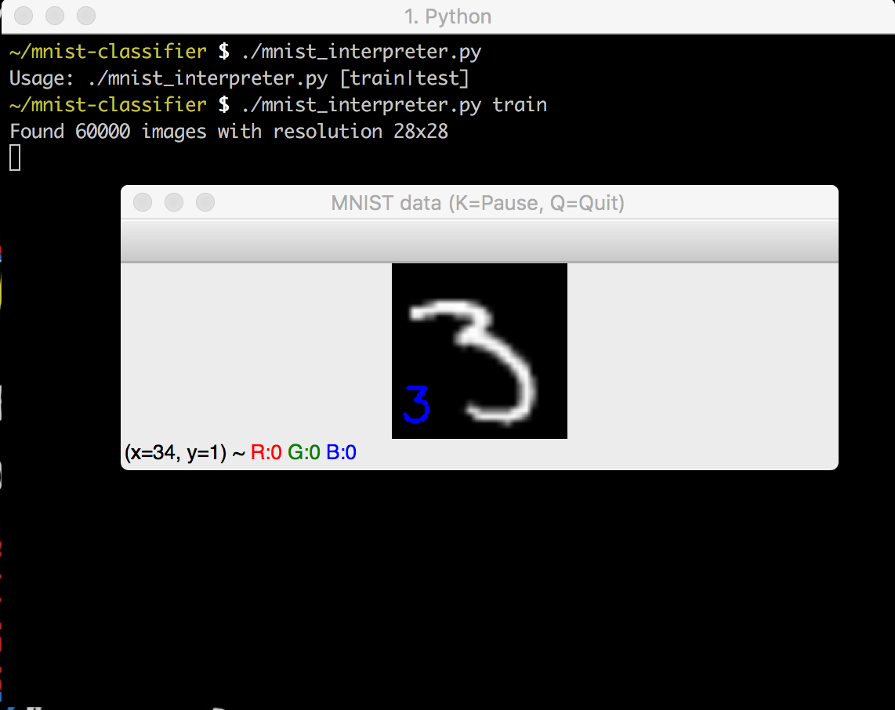
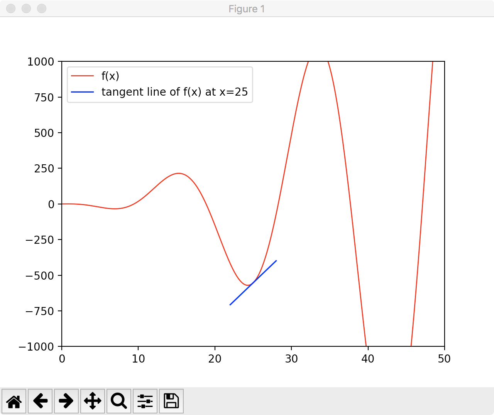

# MNIST Classifier

My "Hello world" project of Neural Networks. It is currently based on the Keras
API, but I am going implement one **literally from scratch** after I mastered
the section of back propagation.

## Prerequisites

Before trying the programs, make sure `numpy`, `opencv-python` are properly
installed.

To run `derivative.py`, you also need `matplotlib` since it is using `pyplot`
to graph functions.

* [mnist\_test.py](mnist_test.py): This is the simplest fully-connected network
 implemented to classify the MNIST handwriting digits. Due to my limitation of
mathematics, the program is written using Keras API.

## Programs that are implemented from scratch

* **[gd\_linearfunc.py](gd_linearfunc.py)**: This script demonstrates **Gradient
Descent** in _Machine Learning_ by fitting a linear function. Though 
it does some apparently useless jobs, it is probably the simplest learning that
makes use of **Gradient Descent**.

> Install **[MathJax Plugin for Github][1]** to view the formulas

This is the form of the linear function to fit:

$$\displaystyle{f(x)=kx+b}$$

And the formula below is how we do gradient descent to the parameters (knowledge
of multivariable calculus may be required to understand this):

$$\displaystyle{\begin{bmatrix}k \\\\ b\end{bmatrix}=\begin{bmatrix}k_0 \\\\ b_0\end{bmatrix}-\alpha \begin{bmatrix}\frac{\partial C}{\partial k} \\\\ \frac{\partial C}{\partial b}\end{bmatrix}}$$

* [mnist\_interpreter.py](mnist_interpreter.py): This is a script that helps you
view the labeled images from either of the training or testing data sets. It
is well-documented, so developers are easy to understand the format of IDX
file and can implement new interpreters by themselves.

* [derivative.py](derivative.py): This script shows the relationship between a
function and its derivative by using tangent line. This is a fundamental concept
for **Gradient Descent** algorithm.

[1]: https://chrome.google.com/webstore/detail/mathjax-plugin-for-github/ioemnmodlmafdkllaclgeombjnmnbima?hl=en-US
